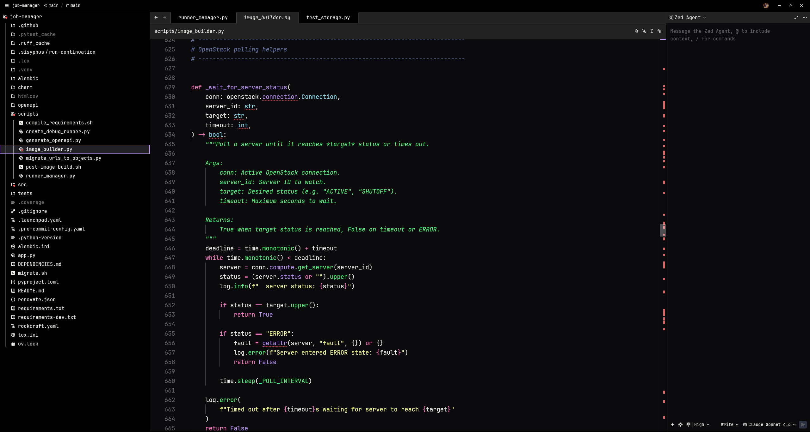
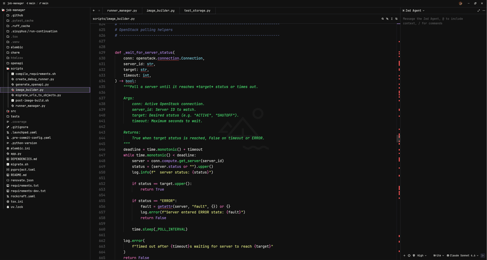

# Pelpsi Night

A dark theme for [Zed](https://zed.dev) — deep black backgrounds with a Dracula-inspired color palette.

## Preview

**Pelpsi Night**


**Pelpsi Night - blurred**


Two variants are included:

| Variant | Description |
|---|---|
| **Pelpsi Night** | Solid dark background |
| **Pelpsi Night - blurred** | Transparent background, designed for use with a blurred/acrylic window effect |

## Color Palette

| Role | Color | Hex |
|---|---|---|
| 🟣 Purple — accent, cursor, functions |  | `#bd93f9` |
| 🩷 Pink — keywords, operators |  | `#ff79c6` |
| 🟡 Yellow — strings, labels, fields |  | `#f1fa8c` |
| 🩵 Cyan — types, variable.special |  | `#8be9fd` |
| 🟢 Green — constants, success, hints |  | `#50fa7b` |
| 🔴 Red — errors, deleted, tags |  | `#ff5555` |
| 🔵 Comments |  | `#6272a4` |
| ⬛ Background |  | `#0b0b0d` |
| ⬜ Foreground |  | `#eff0eb` |

## Installation

### From the Zed Extension Marketplace

1. Open Zed
2. Press `cmd/ctrl + shift + p` and run **Extensions**
3. Search for **Pelpsi Night** and install it
4. Press `cmd/ctrl + shift + p` and run **Theme Selector** to activate it

### Manual

Clone this repo into your Zed extensions directory:

```sh
git clone https://github.com/simonepelosi/pelpsi-night \
  ~/.config/zed/extensions/pelpsi-night
```

Then restart Zed and select the theme via the Theme Selector.

## License

[MIT](LICENSE)
